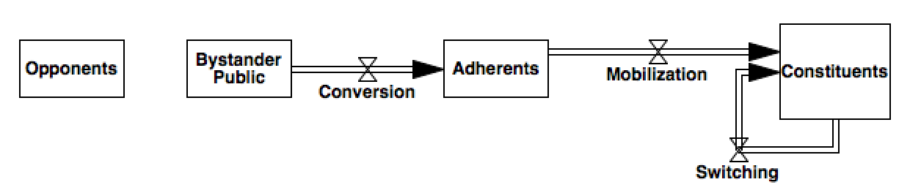

Formalizing McCarthy and Zald 1977
======

The title of McCarthy and Zald's 1977 paper: *Resource Mobilization and Social Movements: a Partial Theory* 

## What makes a theory incomplete?
McCarthy and Zald describe their theory as incomplete:
>"It is a partial theory because it takes as given, as constants, certain components of a complete theory." (pg. 1213)

>"Our attempt has been to develop a partial theory; we have only alluded
to, or treated as constant, important variables-the interaction of authori- ties, SMOs, and bystander publics; the dynamics of media involvement; the relationship between SMO workers and authorities; the impact of industry structure; the dilemmas of tactics." (pg. 1237-1238)

I would argue, however, that what makes a theory incomplete is not that it fails to account for all interesting phenomena. All theories must be bounded, something must always be considered exogenous, and having a boundary to the scope and generalizability of the theory is not something we should treat as shortcoming in and of itself. 

Instead, what would make a theory incomplete is if the structural mechanisms described in the theory fail to logically account for the postulated behavior of the system being explained. In this case, the shortcoming is either that the theory is not fully (or is improperly) elaborated, or that the authors make claims to observable implications of the theory that do not actually arise from the theory itself.

## Formalizing theory to ensure completeness and consistency
When we speak of a theory being not fully elaborated, what we are looking at is the structural consistency of the theory. Do the mechanisms that are postulated connect with one another in consistent ways? Is there a clear, non-contradictory path between hypothesized independent variables and their corresponding dependent variables? The process of formalizing the theory in a mathematical or computer programming language is a useful exercise for discovering where gaps exist in a theory, and suggesting additions or modifications that can make explicit the connections that were previously implicit or undefined.

We can use a different type of formalizing to test for the second case, in which the authors make claims to observable implications that do not arise from the structure of the theory as it is presented. In this case, instead of formalizing the structure of the theory as a simulation model, we can formalize the observable implication of the theory (which are hypotheses about the behavior of the system) as tests of the behavior of the simulation model.

We start by identifying within the publication statements about the structure of the system, and statements about behavior.

When statements about behavior do not have more than one structural link in the theory, they aren't really hypotheses about the behavior that arises from the theory as a construction of mechanisms, so much as an assumption about the behavior of a particular mechanism or piece of system structure, encoded as a statement of behavior.

# Describing the structure
#### Mobilization Chain
McCarthy and Zald categorize individuals according to their relationship with the social movement as being *"...constituents, adherents, bystander publics, [or] opponents" (pg. 1221)* and the movement of individuals between these groups forms the core of resource mobilization theory. Bystanders are the general public, Adherents are those who passively support the goals of the social movement, Constituents are individuals who have affiliated with a particular Social Movement Organization and provide resources to that organization.

Individuals are also categorized in a number of additional dimensions based upon (relatively) fixed attributes: 

- Whether they stand to directly benefit from the achievement of a SM's goals
- The degree to which they are integrated into a community of like-minded individuals
- The level of resources they have at their disposal
- The elasticity of their demand for SMO offerings

The ability of a social movement organization to mobilize individuals, and the extent and type of resources they are then able to provide, is a function of where individuals fall into each of these various categories.

#### Resources
The resources available to a social movement are those which are made available continuously by the constituency. These resources fall roughly into categories of material resources such as money and facilities, labor resources, and social resources such as legitimacy. Resources are available in different measures from different categories of constituent, and different mixtures of resources are required to accomplish different movement objectives.

Resources of any kind are only mobilized through the engagement of individual persons who control them.

## New lessons
- It is ambiguous what is meant by 'engaging in social conflict'. In some ways it is a way of allocating resources
- The term 'mobilizing' is ambiguous. It seems to be used in some ways as 'allocating' resources, such as in "In approaching the task of mobilizing resources a SMO may focus its attention upon adherents who are potential beneficiaries and/or attempt to convert bystander publics who are potential beneficiaries into adherents." pg. 1221-1222 In other places it is used to describe the process of converting bystander publics into adherents "a
SMO may attempt to mobilize as adherents those who are not potential
beneficiaries." pg 1222

## Modeling questions
- Is there a causal relationship between the number of adherents and the ease of converting them to constituents, other than just not running out of adherents to convert?
- What are the processes by which individuals retreat from being constituents to adherents, or from adherents to bystanders?
- What are the mechanisms which cause the failure of an SMO?
- It is unclear whether we should include 'opponents' in the chain of individuals who may become mobilized, if adherents may merely represent another social movement and social movement industry.

## New questions
- Does this model show that competition for resources minimizes efficacy of the movement?
- If SMOs are differentiated by tactic, do we need to differentiate the adherent population in order to see that new tactics coming to the market might make new individuals participate?
- Beneficiary constituents as conferring legitimacy? "Involving only conscience constituents in federated chapters, which might be a method of avoiding such conflict, forces the SMO to pay the price of legitimacy - how can a SMO speak for a beneficiary group when it does not have any beneficiary constituents?" pg 1232

## Theoretical Questions
- "Moreover, a history of accomplishment is an important asset, and, as Gamson (1975) shows for his sample of SMOs, longevity provides an edge in the attainment of legitimacy." pg. 1233 - legitimacy here is an interesting 'resource', in that it comes not just from constituents, but is described as something that is earned to the organization based upon its track record. This legitimacy comes from a different place, and may be qualitatively different than the legitimacy that comes from having the support of beneficiary constituency, or 
- We don't distinguish here  between different levels of resource commitment. What makes some movements obtain fanatical followers, while others just have nominal buy-in? is it just the degree of integration?
- The paper talks about a 'supply and demand' model: "
Treating SMO target goals as products, then, and adherence as demand,
we can apply a simple economic model to this competitive process. Demand
may be elastic, and its elasticity is likely to be heavily dependent upon
SMO advertising." pg 1229. But, the supply side is not really a supply of purchased products in the same way that other products may be. If 'Target Goals' are products, then the supply is not constrained. It is more like a market for selling software, or music, than a commodity market. 
- Alternately, if the solidary incentives and access to SMO leadership are considered to be the product, then there *is* a constraint on supply.
- What would happen if a constituent switched to another SM/SMI? Would they no longer be adherents of the SM?
- perceptions of product quality are ambiguous. Is the product just the target goal, or the presentation of the methods?
- If a social movement is around a certain set of goals - then how can the theory also claim that the goals can be expanded by SMOs? How can the beneficiary constituency change for each SMO without changing for the SM as a whole?
- There is a fundamental tension between specialization and inclusivity. if 

## New observable implications
- in cases where the beneficiary population has strong financial resources, they may be relatively more able to mobilize legitimacy resources to achieve policy objectives. This may be one reason why gay marriage happened so much more quickly than interracial marriage.

## Refs
partial model testing (homer?)